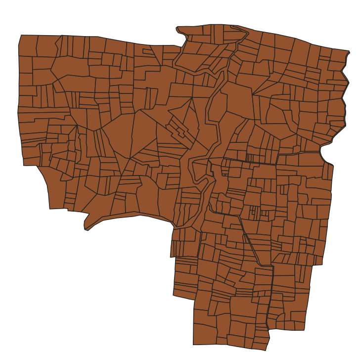

# Geographic Data Report for **sawangi_test**

## QGIS Shapefile



## Table Structure for `public.sawangi`

The following table shows the structure of the `public.sawangi` table after the shapefile has been imported into the PostGIS-enabled PostgreSQL database.

```sql
\d public.sawangi;
```
| Column   |           Type           | Collation | Nullable |               Default                             |
|----------|--------------------------|-----------|----------|--------------------------------------------------|
| gid      | integer                  |           | not null | nextval('sawangi_gid_seq'::regclass)            |
| __gid    | double precision         |           |          |                                                  |
| ccode    | character varying(18)    |           |          |                                                  |
| pin      | character varying(20)    |           |          |                                                  |
| dtncode  | character varying(3)     |           |          |                                                  |
| thncode  | character varying(5)     |           |          |                                                  |
| vincode  | character varying(6)     |           |          |                                                  |
| vil_name | character varying(30)    |           |          |                                                  |
| dtname   | character varying(254)   |           |          |                                                  |
| thname   | character varying(254)   |           |          |                                                  |
| cncode11 | character varying(6)     |           |          |                                                  |
| cncode01 | character varying(8)     |           |          |                                                  |
| lgd_code | character varying(50)    |           |          |                                                  |
| ef_code  | character varying(50)    |           |          |                                                  |
| geom     | geometry(MultiPolygonZM) |           |          |                                                  |

Indexes:
    "sawangi_pkey" PRIMARY KEY, btree (gid)
    "sawangi_geom_idx" gist (geom)
    
## Query Results
### 1. Count of Polygons with an Area Greater than 5 Hectares
To count polygons in the public.sawangi table that have an area greater than 5 hectares (50,000 square meters):
```sql
SELECT COUNT(*)
FROM public.sawangi
WHERE ST_Area(geom) > 50000;
```
count
-------
    30
### 2. Deleting Polygons with pin Value as NULL
To delete polygons from the public.sawangi table where the pin column is NULL:
```sql
DELETE FROM public.sawangi
WHERE pin IS NULL
RETURNING *;
```
```
DELETE 17
```
### 3. Total Perimeter of Sawangi Village
To calculate the total perimeter of all polygons in the public.sawangi table:
```sql
SELECT SUM(ST_Perimeter(geom))
FROM public.sawangi;
```
sum
-------
    293663.292311657


